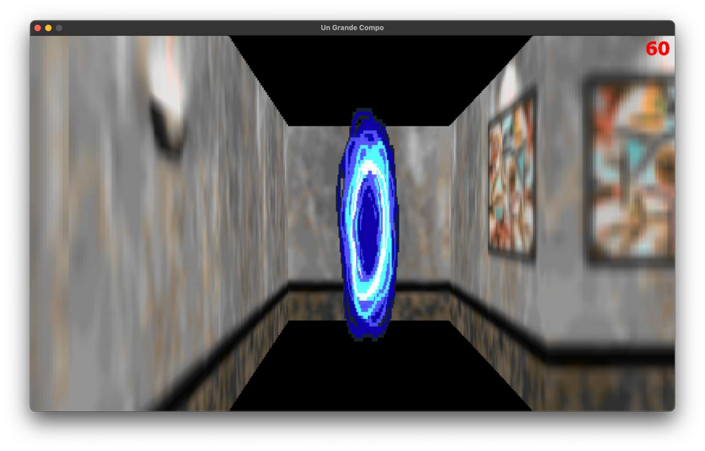
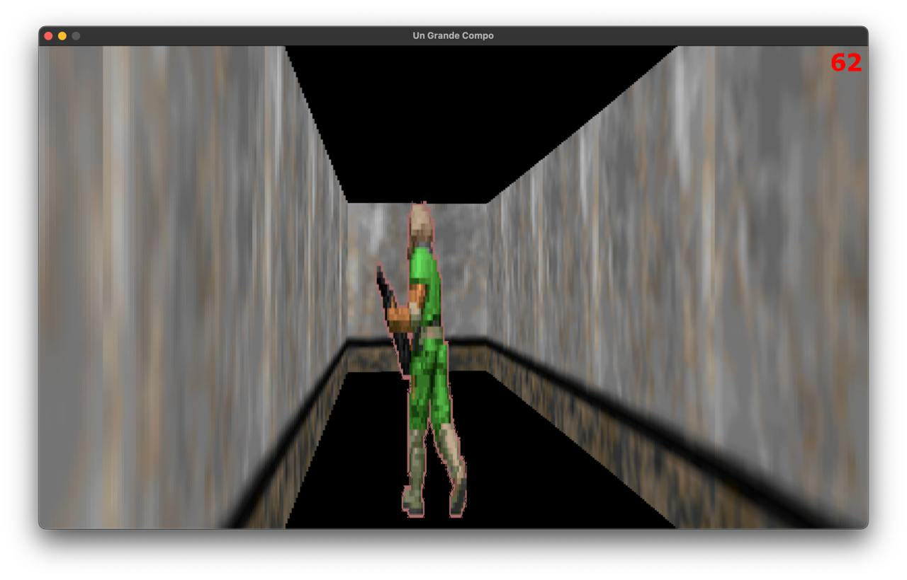
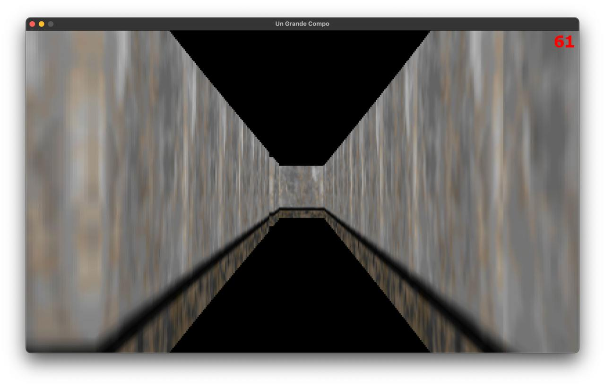

[](https://www.python.org/downloads/)

# Un Grande Compo
## О проекте:
- Игра написана полостью на python, основная библиотека- PyGame.
- Игра создана с технологией ray_casting, данная технология применялась в Doom, Wolfenstein.
- Количество строк кода: 805
- [Сюжет](files/plot.txt)
- [Техническое задание](materials/technical_specification.md)
- [Ссылка на запись](https://disk.yandex.ru/i/j75SEZCybrcG3w)

## 🧱Установка
Вы можете клонировать [**репозиторий**](https://github.com/RomkaGP228/un_grande_compo.git) на вашу систему и установить неоходимые зависимости или сделать все самостоятельно в терминале(для этого вам понадобится python версии 3.11-3.12 и git):
```shell
git clone https://github.com/RomkaGP228/un_grande_compo.git
cd un_grande_compo

# Linux or Mac
python3 -m venv venv
source venv/bin/activate
pip3 install -r requirements.txt
python3 main.py

# Windows
python -m venv venv
venv\Scripts\activate
pip install -r requirements.txt
python main.py
```

## Добавление карты
- Для добавления новой карты вам понадобится вставить ее в файл [levels.json](levels1/levels.json)
- В [main](main.py) вам потребуется записать отработку в стиле: "При такой-то позиции перемести на такую позицию и поставь новую карту"
- Также потребуется изменение констант (main_map и тд)

## Запуск игры
> Первым делом вам откроется стартовое окно, для выхода из игры нажмите Exit, а для старта Start
> 

>Далее вы можете бегать по лабиринту, вам требуется найти сначала портал, а потом военного.
> 
> 
> 

>Вы можете выйти в меню паузы, нажав кнопку Esc
> 
> - В левом нижнем углу расположена кнопка сохранения, при ее нажатии сохранится ваша текущая позиция
> - При нажатии кнопки MENU вы выйдете на главный экран игры
> - При нажатии кнопки CONTINUE вы продолжите игру
> - При нажатии кнопки EXIT вы выйдете из игры(прогресс будет сохранен)
> - При нажатии кнопки настроек у вас откроется меню настроек
>
> - - При нажатии на кнопку SAVE произойдет их сохранение
> - - Прим нажатии кнопки QUIT сохранения не будет
> - - Верхний ползунок отвечает за громкость музыки, а второй за чувствительность мыши
> - При нажатии на кнопку файла откроется меню About
> 
> - - QR-код ведет на репо на гитхабе
> - - кнопка EXIT выводит вас обратно в игру

> Когда вы пройдете игру, вы увидите экран окончания игры
> 
> - Вы увидите перед собой общее время прохождения (в часах)
> - Кнопка EXIT Выведет вас из игры (все сохранения будут стерты)
