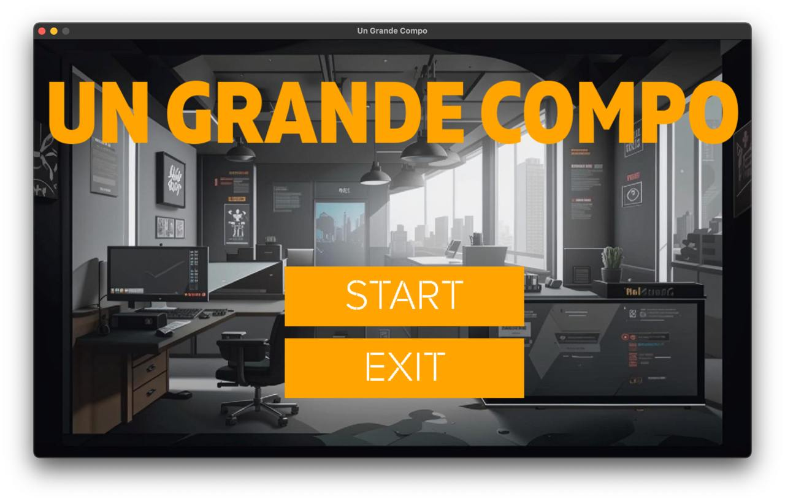
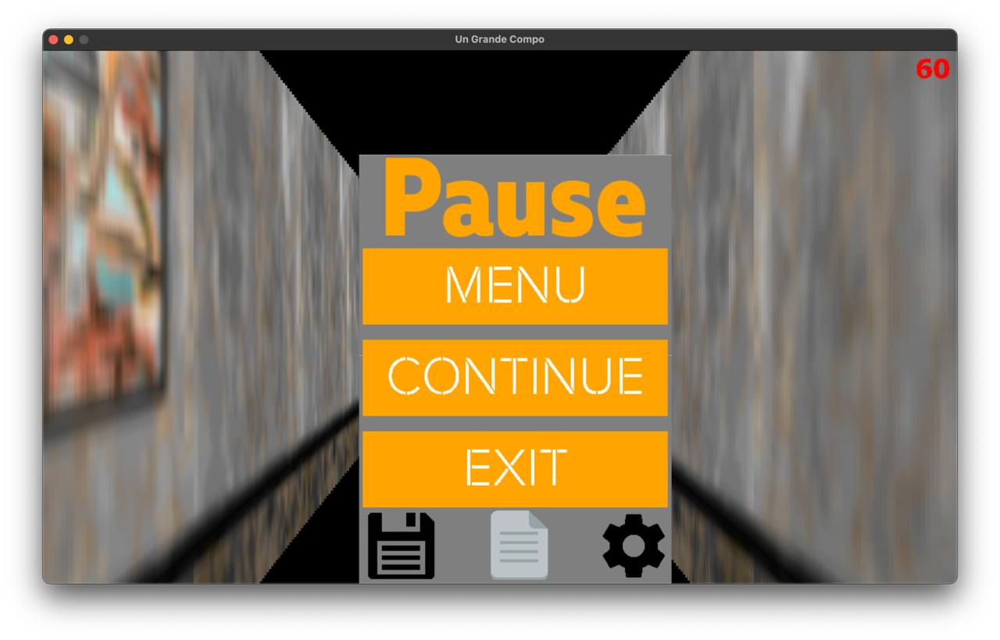
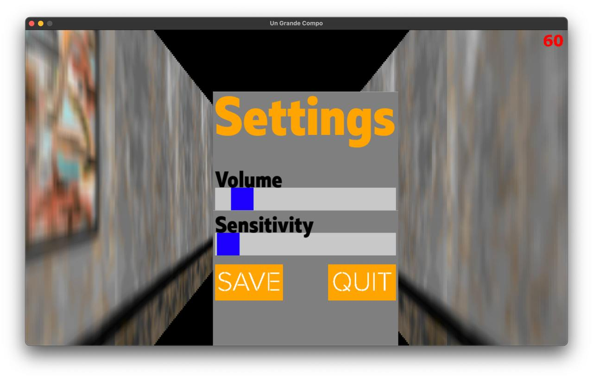
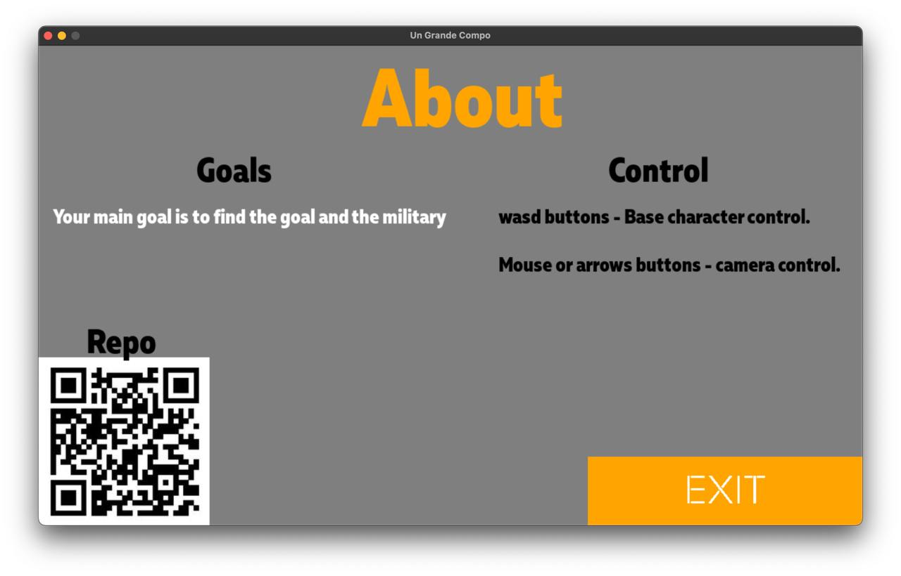
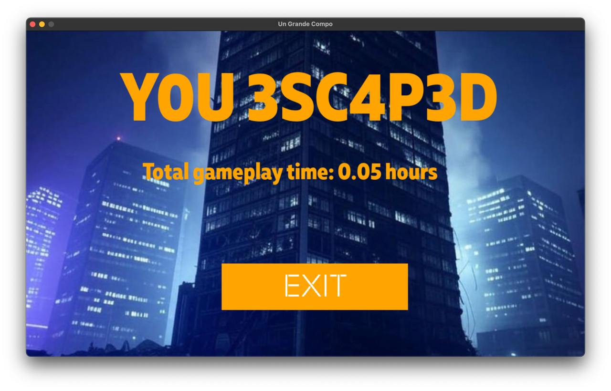

1. __Un Grande Compo__
2. Авторы:
    - Team Lead: Кулаков Роман Антонович
    - Teacher: Анатольев Алексей Владимирович
3. Описание программы:
    - Игра запускается через exe и встречает игрока главным экраном. У пользователя есть выбор: какое-то фиксированное
      значение разных уровней.
    - Также есть кнопка выхода и настроек. В настройках есть выбор громкости песни.
    - При выходе игра спрашивает уверен ли игрок что хочет выйти. Также есть во время игры кнопка сохранения.
    - Игрок управляет программистом, который попал в гигантский офис-лабиринт. Игрок проходит разные уровни.
    - Для звукового ряда планируется Lo-fi nightcore песни. При действии с программистами также будут определенные
      звуки.
    - Окно паузы игры с возможностью сохранения текущего места.
4. 805 строк кода за спиной...
5. Program code plan:
   - Библиотеки:
      - Pygame
      - math
      - pathlib
      - os
      - sys
   - Классы:
      - Player
      - Draw
      - SpriteClass
      - SpriteObject
      - Button
      - Slider
   - Функции:
      - play_track
      - volume_change
      - first_time
      - upload
      - saver
      - upload_map
      - settings_saver
      - upload_settings
      - time_finder
      - load_image
      - ray_casting
      - mapping
   - Также потребовались в проекте глобальные переменные для упрощения написания кода:
      - colors
      - ray_casting constants
      - sprite settings
      - window settings
      - player params
6. Graphic Interface
   
   
   
   
    